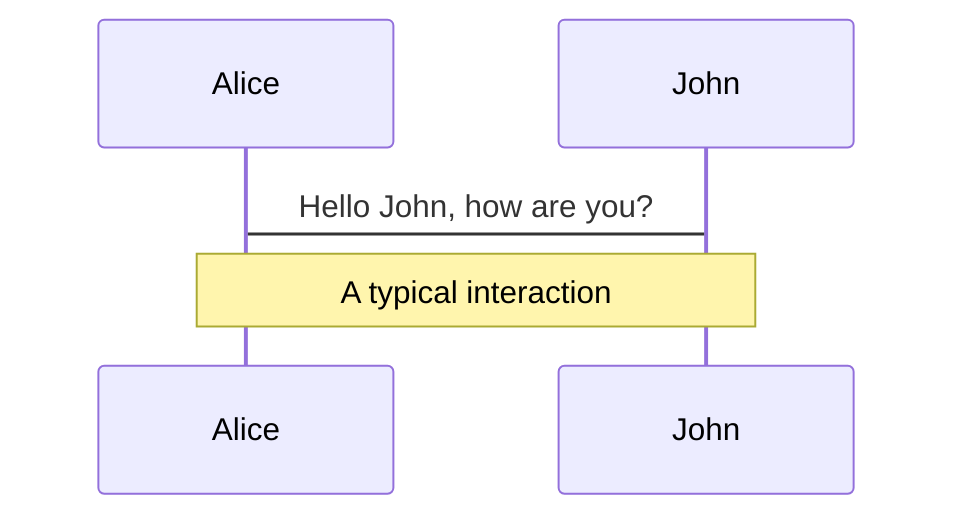

<!-- classes: title -->


# わたしが新人だったころ


<!--
The last comment block of each slide will be treated as slide notes. It will be visible and editable in Presenter Mode along with the slide. [Read more in the docs](https://sli.dev/guide/syntax.html#notes)
-->


---

# その前に

---

# yamada_n どちら様

- ID: e99h2121 で色んな所にいます。
- 名前は yamada_n とか YAMADA Nobuko とか書いてます。
- 自社内でも やまださん で通っております。
- 写真は私です。

Read more about [e99h2121](https://e99h2121.github.io/)

---

# yamada_n どちら様

- 2016生まれの娘さん、2018生まれの息子氏がいます。

- 乱入する何かが現れたら彼らです (本日は寛大な心でよろしくおねがいいたします) 。

- [【インタビュー】子育てをしながらリモートでITエンジニアとして働く山田 展子さんを徹底取材！｜テレラボ｜リモートワーカーのための求人メディア](https://tele-labo.jp/company/6202) なんて取材をしてもらったことがあります！

---

- 弊社 = 「HR（人事給与）パッケージソフト」を作っています。

- 「日本のリーディングカンパニーから選ばれる」、SmartではないHRな会社、です。

- 会社としては私から巻き込まれ事故をくらいたくないようで公共の場での発言には気をつけています。今日は個人戦のつもりで来ました。笑

- でも同僚は[こういうところに出ていたり](https://speakerdeck.com/whisaiyo/developers-summit-2021)。

- [こんな超優秀な同僚に囲まれています](https://qiita.com/autotaker1984/items/894bf0df0009c621da11)。

---

- 2003年に新卒・文系・未経験として入社、今に至ります。

- プログラミングは入社してから覚えたほうの人です。

- 世が世なら駆け出しエンジニア。


---

- 研修はDelphiとCOBOLでした。

- 「3層構造」が流行り始める頃だったみたいです。

- 顧客対応したりしているうちに年号は令和になっていました (そういえば年号対応とかやったなあ)。


```pas
procedure TForm1.Button1Click(Sender: TObject);
begin
  Showmessage('Hello World!');
end;
```
---

- その後10年以上開発、保守。得意技、バッチ処理。主戦場はバックエンド。

- サーバー間を行ったり来たりする図を書くのが得意です。



---

- 製品はいつの間にかクラウドに。

- 最近は[AWS Fargate](https://qiita.com/e99h2121/items/38cb0e004d51dffd2716) だなんだと言っている。

- 途中上海赴任するなどとは思ってもみませんでしたが、当時の上司に「こいつは何があってもしなないと思った」という理由で赴任させてもらえました。

---

- この辺の記事書いたひと、と言って思い出してもらえたら嬉しいかも。
    - [海外「なぜ日本はハードウェアの時代と同じようにソフトウェアに秀でることができない？」 - Qiita](https://qiita.com/e99h2121/items/419c3bd39d8dea40f21a)
    - [エンジニアはどこまで勉強すればよいのか - スキルマップと生存戦略を考えた - Qiita](https://qiita.com/e99h2121/items/a41339815d9aea87bdb4)
        - [エンジニアは英語をどこまで勉強すればよいのか - 英語に関する2つのご意見 - Qiita](https://qiita.com/e99h2121/items/c6afa788d87dbcb09175)
        - [エンジニアは数学をどこまで勉強すればよいのか - 「プログラマの数学」を薦めたい - Qiita](https://qiita.com/e99h2121/items/fb8f04637cc420c7e1f6)
    - [開発者が考える提案書テンプレート markdown版 - Qiita](https://qiita.com/e99h2121/items/d690ea1fb7e9f9eb9ad4)
    - [海外との多拠点開発の話 - 上海でブリッジ開発をしていたときに感じていたことを振り返る - Qiita](https://qiita.com/e99h2121/items/6ec28c4ce991898503cc)

---

- 長くなるのですが

- 今日は「[新人プログラマ応援 - みんなで新人を育てよう！ - Qiita](https://qiita.com/official-events/63aa63fd921659fb3b5d)」にあやかって、自己紹介がてら、私の新人時代の話を振り返ってみたいです。

---

皆様は語れる失敗経験、あるでしょうか。

---

何でこんな話題を選んだのか。

---

# 失敗

---

ではなくて、失敗を話すのは年長者こその責任、使命なのではと私は思います。

---

- だから、私の入社以来の自慢エピソード。

- 遡る2003年、新卒入社当時の話を聞いていただこうと思って今日は来ました。

---

- 2003年、夏。私は現在の会社で新規プロダクトの開発チームに配属されました。

- 「新製品なので、新人がやっても年長者がやっても同じや！」という謎な理由でした。

- ラッキー。

---

- が、2年目にもなる頃、どうしてもそのプロジェクトの進行に我慢と納得が行かなくなった。いわゆる炎上（自粛

- 周りの先輩もいろいろでした。

- 私が取った行動

---

- 自分で座席を既存プロダクトのチーム付近に移動して、既存プロダクトの仕事を <s>勝手に</s> 自主的にはじめました。

- それが今いるHRという製品なのですから、今の私は当時の私が作ったと言ってよい...

---

- 当然、受け入れ側の各位には怒られる。

- が、新人なりに <s>頑固な心</s> 確たる信念があったので、後付でいつのまにか社内異動を達成しました。

- HRの会社なのに私の社内異動履歴どうなっているのかはわかりません。

---

- 謎です。

- というかそんな新人、いま隣の席に来たら私も嫌です。笑

---

- フルリモートワークバンザイ

---

- 失敗というよりはゴリ押し？な経験だったり、少しだけ期限に遅れたり忘れていたり、ソースの確認が浅かったり

- 寝ぼけていたり同じことを繰り返したりやる気が出なかったり

- あ、社歴が長くなってくると常に「自分は老害になっていないか？」

- 「そろそろ定年なんじゃねーの？(35歳定年説)」のジレンマと向き合わされ恥ずかしきことも増えます。

---

- でも自分が失敗と思っていることなんて、意外と人から見たら些細なことだったりもする。

---

- そして相変わらず不具合や仕様を説明するのは得意ではないです！

- しかし振り返ってそれを次に生かしたり、学びを記事にできるなら、まあ美味しいんですよね～。だから、それを書いています！

---

- 私がそれなりに界隈に居座れているのだから、皆どんどん失敗したらいいぞー、と自分の周りには言いたい。無責任もたまには大事。

- 早20年近くサバイブしてきた身として、失敗をどうとらえるか、どう受け流すかを改めてまとめてみるのは、大事だと思いました。

---

# ちなみに今日のスライドは以下に基づいております

- [「失敗を許容する」なんて言われても失敗したくないです - Qiita](https://qiita.com/e99h2121/items/873281d73cc504e5a64d)

- [Markdownでオシャレなスライドを作るSli.dev - Qiita](https://qiita.com/e99h2121/items/a115f8865a0dc21bb462)

---

# そしてもちろんQiita芸人としてはまだまだ若輩者です

- [テクニカルライティングチームのお仕事 2021年6月版 - Qiita](https://qiita.com/e99h2121/items/3da004b8194a64c4f207)

- [Markdownファイル校正手順 - 実務編 - Qiita](https://qiita.com/e99h2121/items/2b7aaa1625db2785d3bd)

- [そういえば弊社もCOBOL保守してるけど全然触ったこと無いなという人向け、COBOLを完全理解できる記事 - Qiita](https://qiita.com/e99h2121/items/47857957fd549c83b5cb)

- [そろそろTypeScriptに入門するから、TypeScriptとは何なのか、どう良いのか書いておく - Qiita](https://qiita.com/e99h2121/items/09892779dcb26a70bc97)

- [なぜ開発チームは私の起票した要望をなかなか実装してくれないの？への苦悩 - Qiita](https://qiita.com/e99h2121/items/f4c5856734d136f672b7)

- [私にコーヒーをおごってほしい - エンジニアと報酬・対価について考えた - Qiita](https://qiita.com/e99h2121/items/088e25ab66535836c05c)

- [結局UMLとかシーケンス図とかAWSの図とかどれで描くと良いのよ？と思ったときの選択肢 - Qiita](https://qiita.com/e99h2121/items/eaca084ae7b0488ab686)

---


以上自己紹介が長くなってしまいました。

少しでも面白いものを見つけていただけたら、さいわいです。またこれによって「失敗」なんて大したこと無いなと思っていただけたらうれしいです。


---

# Learn More

## 続きはこれからもよろしくおねがいします！

https://qiita.com/e99h2121

https://twitter.com/e99h2121

https://e99h2121.github.io/

etc.
